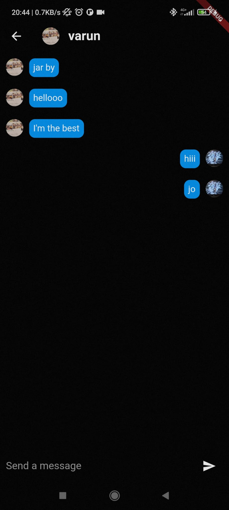

# InstaOunce

_InstaOunce (Shron's App) is a social media application. With great aesthetics and features, this app allows you to post pictures, connect with people and even chat with them. It is built with **Flutter** and **Firebase** to provide good animations and real time updates_

## Images
<style>
  .DIV{
  display: flex
}
 </style>
<div class = "DIV">



</div>

## Getting Started

1. Get all the dependencies in `pubspec.yaml` by :
```
  flutter pub get
```
2. Create your Firebase application and connect it to your flutter application (Firebase tells you how)
3. Run the app on your preferred emulator or device

Congratulations! you can now use this app and hace fun!!

[^first]: Footnote: Disclaimer: this app was created for personal use and is a non-profit app. The name chosen (InstaOunce) is for comedic purposes.
